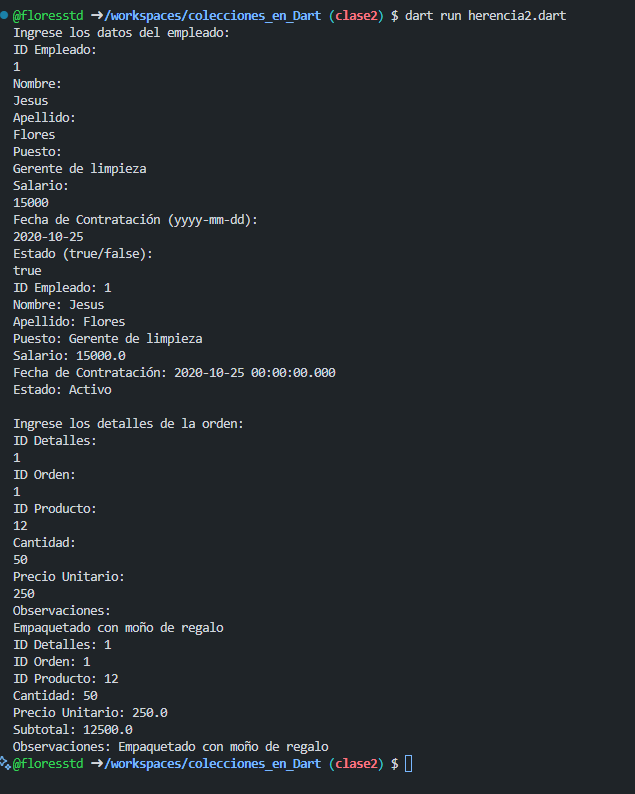

vcrear la clase empleados con atributos (ID_Empleado, Nombre, Apellido, Puesto, Salario, Fecha_Contratacion y Estado) "Los datos se capturan desde la interfaz". Una clase Juan con herencia y una funcion mostrardatos()
crear la clase Detalles_Orden con atributos (ID_Detalles, ID_Orden, ID_Producto, Cantidad, Precio_Unitario, Subtotal, Observaciones) "Los datos los introduce el usuario". Una clase Orden1 con herencia y una funcion mostrardatos(). Lenguaje Dart

salida

